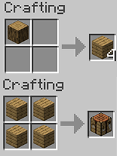
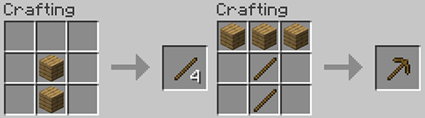
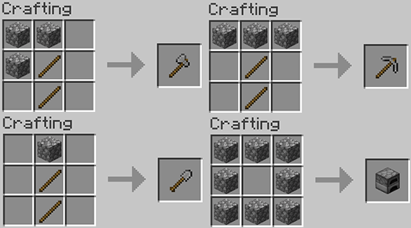
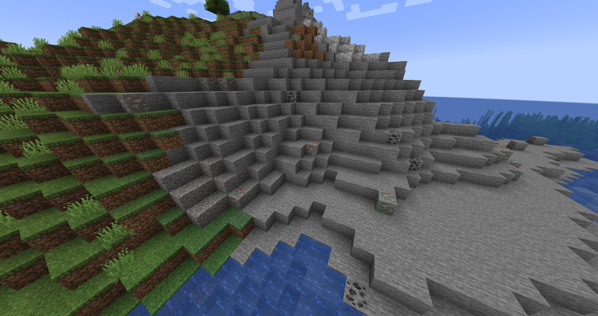
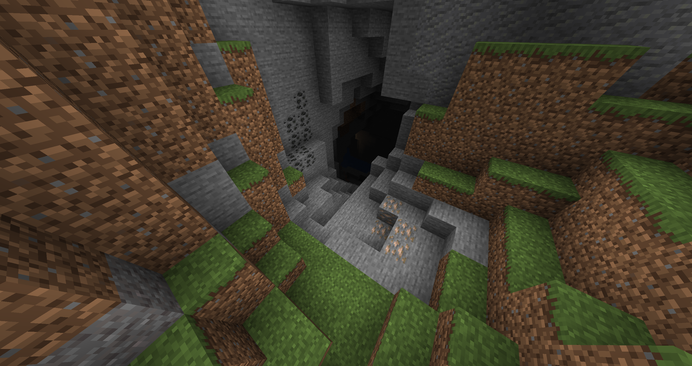
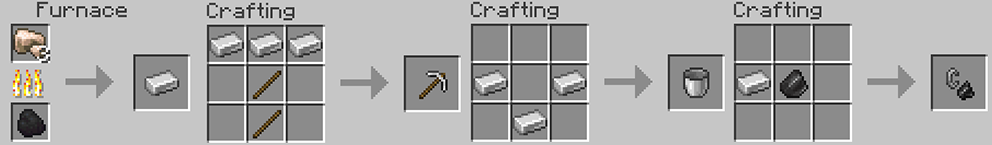
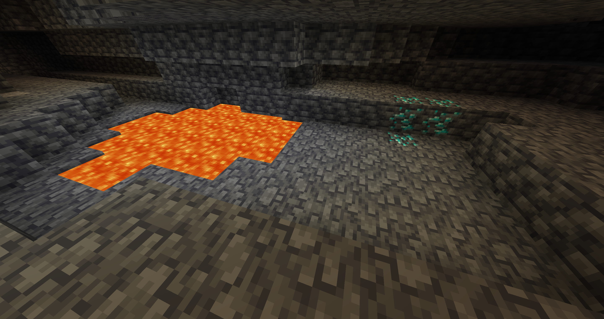
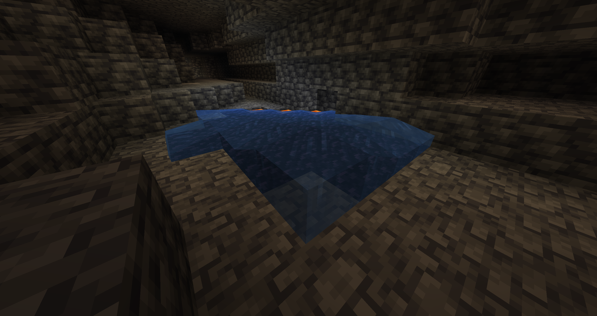
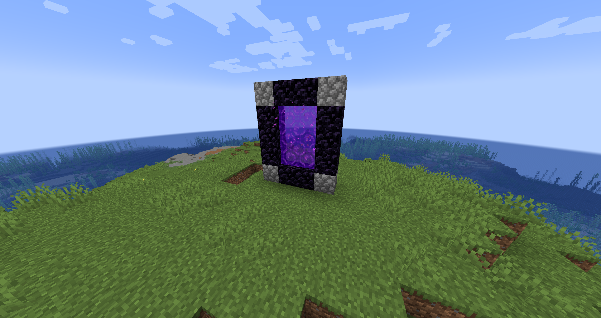

# 🌌 Minecraft-veiledning: Hvordan komme til Nether fra starten 🌋

Klar til å utforske Netthers flammende dyp? Følg denne trinnvise veiledningen for å samle ressurser og bygge en Nether-portal i en helt ny Minecraft-verden!

---

## 🌲 Trinn 1: Samle grunnleggende materialer

1. **Samle tre** 🌳  
   - Start med å slå på trær for å samle **trestokker**.  
   - Gjør stokkene om til **planker** og lag et **arbeidsbenk**.
   
   

2. **Lag treverktøy** 🪓  
   - Bruk plankene til å lage **pinner** og lag en **trehakke**.

   

3. **Samle stein** 🪨  
   - Finn stein og grav den ut med trehakken.  
   - Samle minst 19 steinblokker for å lage:  
     - **Steinhakke**  
     - **Steinøks**  
     - **Steinspade**  
     - **Ovn**

   

---

## 🛠️ Trinn 2: Oppgrader til jernverktøy

1. **Finn jern og kull** ⛏️  
   - Utforsk huler eller klipper for å finne **jernmalm** og **kull**. 

    
    

   - Grav ut minst **7 jernmalmer**:  
     - **3 jernbarrer** for en jernhakke  
     - **3 jernbarrer** for en bøtte  
     - **1 jernbar** for en flint og stål

2. **Grav grus for flint** 🪨  
   - Grav grus til du finner **flint** (brukt til å lage flint og stål).  

3. **Smelt jernmalmen** 🔥  
   - Bruk ovnen din til å smelte jernmalm til **jernbarrer**.  
   - Lag en **jernhakke** og en **bøtte** for å forberede deg på diamant- og obsidiangruving.

    
---

## 💎 Trinn 3: Finn diamanter

1. **Let etter store huler** 🕳️  
   - Utforsk store huler som går dypt under bakken.  
   - Ta med nok fakler og mat for å holde deg trygg. 

    

2. **Finn diamanter**  
   - Se etter **diamantmalm** på dype nivåer i hulen (under nivå Y-16).  
   - Bruk **jernhakke** til å grave ut minst **3 diamanter**.
   
    

3. **Valgfritt**: Samle ekstra diamanter for rustning eller verktøy.

---

## 🔥 Trinn 4: Samle obsidian

1. **Finn en lavapøl i hulen** 🌋  
   - Store huler har ofte eksponerte **lavapøler**.  

2. **Lag obsidian** 💧  
   - Bruk en **bøtte med vann** for å helle vann over lavaen og lage obsidianblokker.  

    

3. **Grav ut obsidian**  
   - Bruk **diamantspade** til å samle minst:  
     - **10 obsidianblokker** (minimum for en portal)  

---

## 🛠️ Trinn 5: Bygg og tenn Nether-portalen

1. **Bygg portalkanten** 🧱  
   - Bygg en **4 blokker bred og 5 blokker høy** ramme:  
     - Bruk **2 obsidianblokker** til bunnen.  
     - Bygg **to vertikale søyler** som er **3 blokker høye hver**.  
     - Plasser **2 obsidianblokker** på toppen som kobler søylene.  
   - Du kan **erstatte hjørnene** av portalen med andre blokker (som jord eller stein) for å spare materiale.

2. **Tenn portalen** 🔥  
   - Bruk **flint og stål** (laget av 1 jernbarr og 1 flint) til å tenne portalen ved å høyreklikke eller interagere med en indre blokk.

    

---

## 🚪 Trinn 6: Gå inn i Nether

1. **Forbered deg på eventyr** ⚔️  
   - Utstyr deg med rustning, våpen, mat og byggematerialer.  

2. **Gå inn i portalen**  
   - Stå i portalens lilla, virvlende interiør for å teleportere til Nether.

    

---

## 🌋 Tips for å utforske Nether

- **Gullutstyr**: Bruk minst ett gullutstyr for å unngå angrep fra Piglins.  
- **Byggematerialer**: Ta med stabler av blokker for å bygge broer eller ly.  
- **Trylledrikker**: Ildmotstandsdrykker er livsviktige i lavafylte områder.  

---

🎉 **Gratulerer!** Nå er du klar til å møte utfordringene i Nether. Lykke til og god utforskning!  
